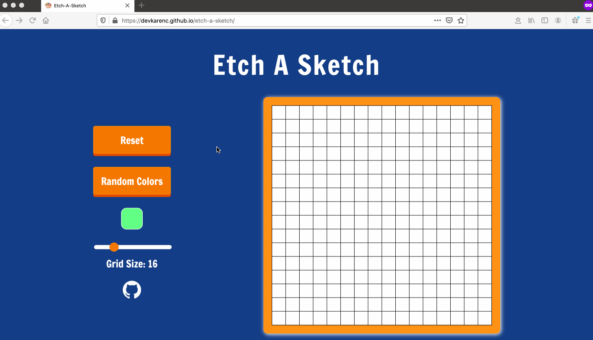

## Etch-A-Sketch

This modern Etch-A-Sketch drawing board allows you to express your creativity in a browser. Simply start by hovering over the board with your mouse cursor. Need a different color? No problem! You can randomly select colors by clicking on the Random Colors button or choose your own color with a color picker. Need a more precise drawing board? You got it. Use the slider to change the number of squares in the board. Need to wipe the board clean? Just do it. Use the reset button to start a different drawing.

Master the art of drawing with the <a href="https://devkarenc.github.io/etch-a-sketch/" target="_blank">modern Etch-A-Sketch!</a>

## Demo Sketch

---

Thanks to The Odin Project for providing an idea and guidance for this project! 🎊
